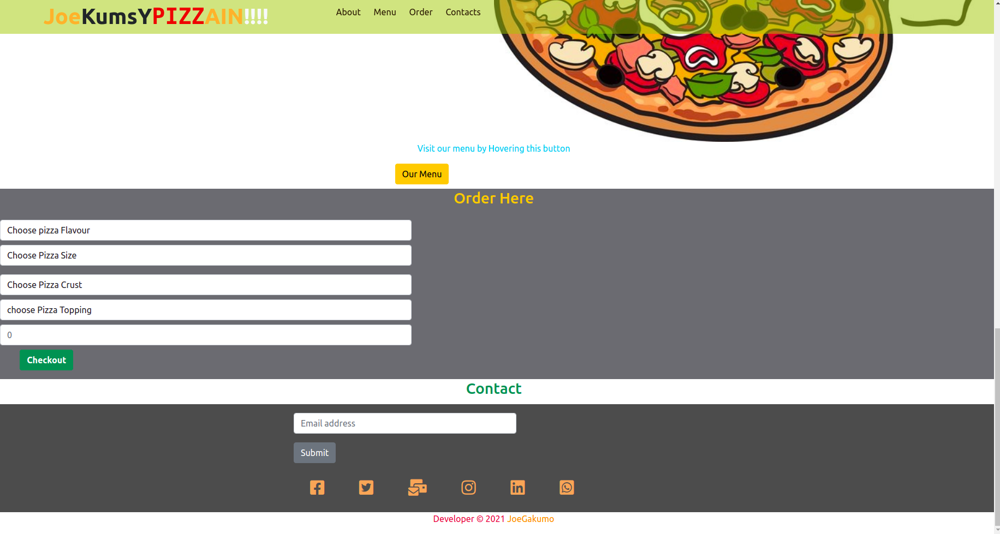

#  JOEKUMSY PIZZAIN WEBSITE
### Develoed by <a href="#">Joseph Gakumo Munyui</a>
# Description
This is a website that allows customers to order pizza of different types, add their favorites, toppings and crusters and chekout the order and incase of delivery they indicate.

# setup Installation
the website is hosted at Git
so incase you need a copy ensure you are in the right folder the type the following

 * git clone https://github.com/JoeGakumo21/Pizza-App-website
# Set requirements
* browser
* github

# technology used
* HTML
* CSS
* BOOTSTRAP
* JAVASCRIPT
* JQUERY

# live link
 * access the website via this link <a href="">JoeKumsy PizzaIn website<a/>

# know bugs
so far no bugs on the website

# contact
incase of any comment reach me via
 * tel :0791279635
 * email :joegakumo1@gmail.com

 # screenshots

# LICENCE
<a href="https://choosealicense.com/licenses/mit/">MIT LICENCE</a>

* &copy; 2021 Joseph Gakumo